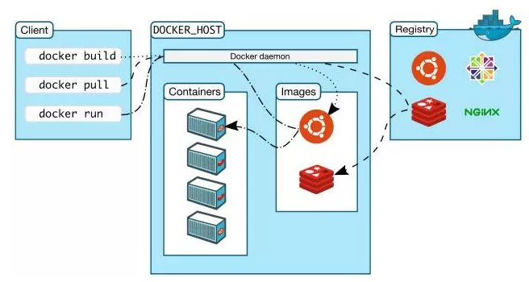
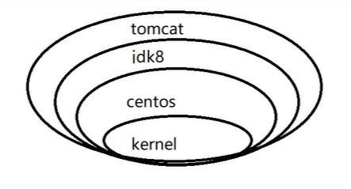
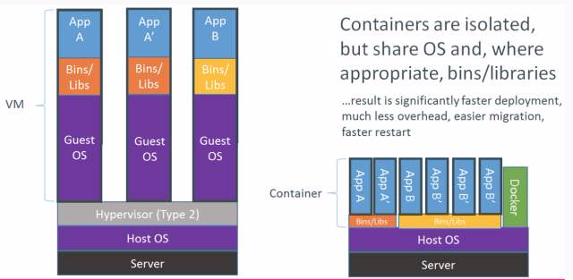
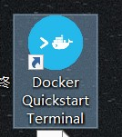
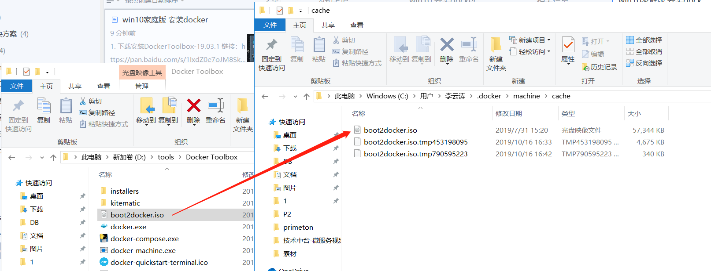
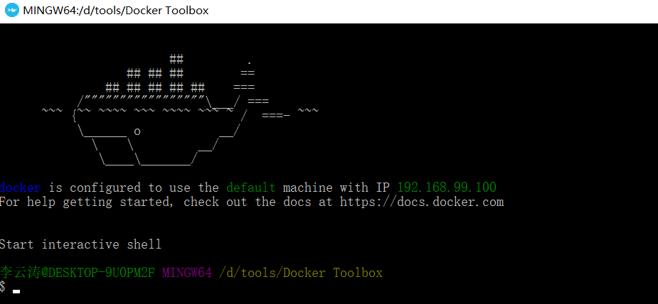
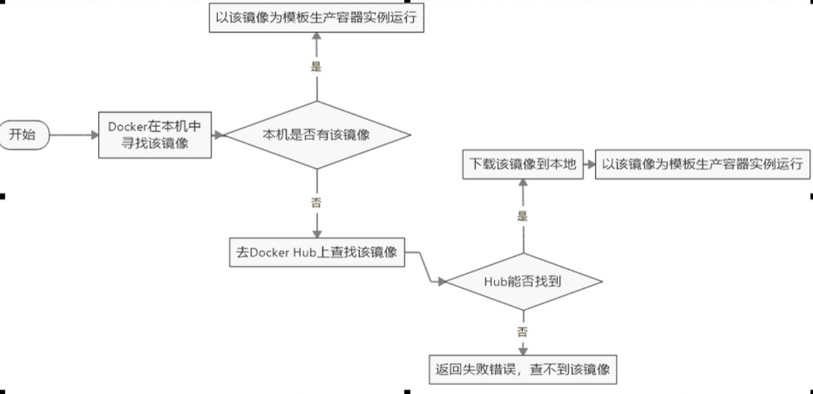
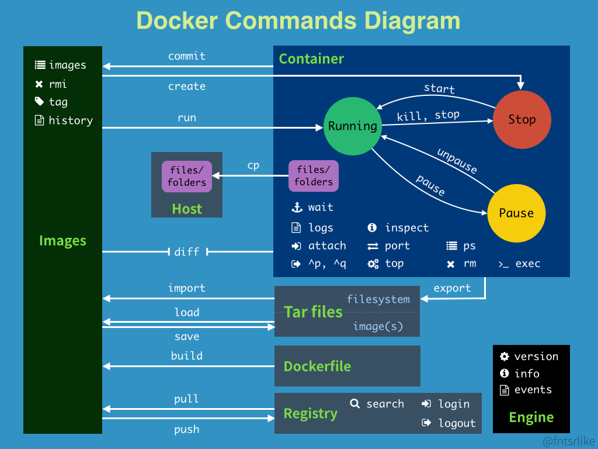
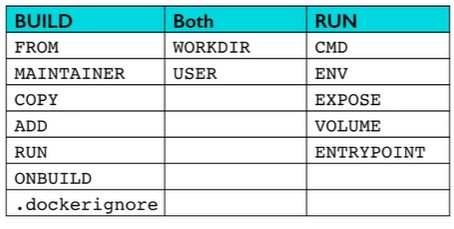

   * [<strong>一、概念</strong>](#一概念)
      * [1.1 是什么](#11-是什么)
      * [1.2 能干什么](#12-能干什么)
      * [1.3 基本概念](#13-基本概念)
      * [1.4 Docker架构](#14-docker架构)
         * [1.4.1 docker镜像加载原理](#141-docker镜像加载原理)
      * [1.5 与虚拟机对比](#15-与虚拟机对比)
         * [1.5.1 为什么docker比虚拟机快](#151-为什么docker比虚拟机快)
      * [1.6 相关资料](#16-相关资料)
   * [二、安装](#二安装)
      * [2.1 Windows安装](#21-windows安装)
         * [2.1.1. 下载](#211-下载)
         * [2.1.2. 执行](#212-执行)
         * [2.1.3. 替换ISO](#213-替换iso)
         * [2.1.4. 运行](#214-运行)
      * [2.2 Linux安装](#22-linux安装)
         * [docker-compose](#docker-compose)
         * [三、使用](#三使用)
      * [3.1 镜像加速](#31-镜像加速)
   * [四、命令详解](#四命令详解)
      * [4.1 部分命令详解](#41-部分命令详解)
         * [4.1.1 docker run](#411-docker-run)
      * [4.2 命令大全](#42-命令大全)
         * [4.2.1 帮助命令](#421-帮助命令)
         * [4.2.2 镜像命令](#422-镜像命令)
         * [4.2.3 容器命令](#423-容器命令)
   * [五、容器数据卷](#五容器数据卷)
      * [5.1：概念](#51概念)
      * [5.2：特点](#52特点)
      * [5.3：使用](#53使用)
   * [六、Docker File](#六docker-file)
      * [6.1 构建Dockerfile](#61-构建dockerfile)
      * [6.2 案例](#62-案例)
   * [常见错误](#常见错误)

# **一、概念**

## 1.1 是什么

  Docker本身是一个容器运行载体，或称之为容器管理引擎，我们将应用程序和配置依赖打包好形成一个可交付的运行环境。这个打包好的运行环境本身就是Image镜像文件。

只有通过这个镜像文件才能生成Docker容器

- 解决了运行环境问题的软件容器，方便做持续集成，有助于整体运维。
- 容器直接运行在宿主机的内核，没有自己的内核，不会对硬件进行虚拟。
- 容器不是模拟完整的操作系统，而是对进程进行隔离。
- 容器之间互相隔离，容器之间进程不会互相影响，**耦合度低**。
- 

## 1.2 能干什么

- **提供一次性环境**：比如功能测试时候，将所有软件打包成为一个整体镜像提供给测试人员测试
- **提供弹性的云服务**：因为 Docker 容器可以随开随关，很适合动态扩容和缩容。
- **组建微服务架构**：通过多个容器，一台机器可以跑多个服务，因此在本机就可以模拟出微服务架构。

## 1.3 基本概念

- **镜像（Images）**：镜像是一个只读的模板，镜像可以用来创造Docker容器，一个镜像可以创造很多容器，*等同于Java中的类。*
- **容器（Containers）**：容器是用镜像创建的运行实例，*等于Java中类的实例化对象。*
- **仓库（Repository）**：仓库是集中存放镜像文件的场所。

 

```
/**
* Person-镜像
* p1\p2\p3 - 容器
*/
Person p1 = new Person();
Person p2 = new Person();
Person p3 = new Person();
```

## 1.4 Docker架构



- Client：客户端（shell）

- DOCKER_HOST：

- - Images：镜像
  - Containers：容器

- Register：注册仓库，

  客户端运行命令，从远程仓库上将镜像拉到本地，某一个镜像的实例就是容器，放在容器里就是运行环境。

### 1.4.1 docker镜像加载原理

参考：https://www.techgrow.cn/posts/eb291124.html

- Union File System : 联合文件系统，可继承

- - 共用kernel，每个镜像的rootfs可以叠加其他镜像的，他们共用kernel
  - 最外面一层是可读写的，其他层都是只读的

*一个典型的tomcat image，只有tomcat是可读写的，其他都是只读的*



## 1.5 与虚拟机对比



### 1.5.1 为什么docker比虚拟机快

- docker不需要Hypervisor实现硬件资源虚拟化，程序直接使用实际物理机的硬件资源。
- docker直接利用宿主机的内核，不需要Guest OS，因此新建容器时不需要像虚拟机一样重新加载一个操作系统内核。

## 1.6 相关资料

 

```
#阮一峰 - Docker入门教程
https://www.ruanyifeng.com/blog/2018/02/docker-tutorial.html

#阮一峰 - Docker 微服务教程
https://www.ruanyifeng.com/blog/2018/02/docker-wordpress-tutorial.html

#阮一峰 - Nginx 容器教程
https://www.ruanyifeng.com/blog/2018/02/nginx-docker.html

#aliyun容器镜像服务
https://cr.console.aliyun.com/?spm=5176.8351553.products-recent.dcr.6cd61991a9EBsf
```

# 二、安装

## 2.1 Windows安装


### 2.1.1. 下载

下载安装DockerToolbox-19.03.1

链接：https://pan.baidu.com/s/1IxdZ0e7oJM8Skw-nVlutWw 

提取码：azei 

复制这段内容后打开百度网盘手机App，操作更方便哦

### 2.1.2. 执行

安装后执行Docker Quickstart Terminal



### 2.1.3. 替换ISO

如果提示下载报错或者下载慢可以将安装路径下的boot2docker.iso拷贝到对应的缓存目录



### 2.1.4. 运行

重新运行Docker Quickstart Terminal

直到出现下图样式，说明docker启动成功，每次计算机重启第一次运行docker都需要quickstart




## 2.2 Linux安装

 

```
#参考
https://docs.docker.com/install/linux/docker-ce/centos/

# 1. 安装依赖包与必要的驱动程序
sudo yum install -y yum-utils device-mapper-persistent-data lvm2

# 2. 设定仓库
sudo yum-config-manager --add-repo https://download.docker.com/linux/centos/docker-ce.repo

# 3. 安装最新版本
sudo yum install docker-ce docker-ce-cli containerd.io

############### 3. 安装特定版本
##列出版本列表
yum list docker-ce --showduplicates | sort -r
##选择特定版本安装
sudo yum install docker-ce-<VERSION_STRING> docker-ce-cli-<VERSION_STRING> containerd.io

#启动docker
sudo systemctl start docker

#运行helloworld测试
sudo docker run hello-world
```

helloworld运行成功！！安装测试成功！！！


或者使用这个脚本全自动安装

[](wiz://open_attachment?guid=5061c02e-0795-4eb6-8b04-2b8f6cd60a03)

### docker-compose

 

```
sudo curl -L https://get.daocloud.io/docker/compose/releases/download/1.25.1/docker-compose-`uname -s`-`uname -m` -o /usr/local/bin/docker-compose

sudo chmod +x /usr/local/bin/docker-compose

docker-compose --version
```

### 三、使用

## 3.1 镜像加速

 

```
#参考
https://help.aliyun.com/document_detail/60750.html?spm=5176.8351553.0.0.6cd61991a9EBsf

#复制下面整段命令直接在控制台粘贴
sudo mkdir -p /etc/docker
sudo tee /etc/docker/daemon.json <<-'EOF'
{
  "registry-mirrors": ["https://262le5w0.mirror.aliyuncs.com"]
}
EOF
sudo systemctl daemon-reload
sudo systemctl restart docker
```

# 四、命令详解

## 4.1 部分命令详解

### 4.1.1 docker run



## 4.2 命令大全



以下列举部分，详细以及命令的参数参考

https://www.runoob.com/docker/docker-command-manual.html

### 4.2.1 帮助命令

 

```
# 查看版本号
docker version

# 查看容器信息
docker info

# 帮助命令
docker --help
```

### 4.2.2 镜像命令

 

```
#列出本地镜像列表
docker images

#查询仓库中的某个镜像
docker search 镜像名

#将仓库中的镜像下载到本地
docker pull 镜像名

#删除本地镜像
docker rmi 镜像ID（或唯一镜像名）
docker rmi -f 镜像ID（或唯一镜像名）
##删除多个本地镜像
docker rmi -f 镜像名1 镜像名2
##删除所有本地镜像
docker rmi -f $(docker images -qa)

#提交镜像
docker commit -a="author" -m="description info..." containerID packageName/imageName:1.0
```

### 4.2.3 容器命令

 

```
##
# 创建、启动容器
docker run [OPTIONS] IMAGE [COMMAND] [ARGS....]
docker start 容器ID
# OPTIONS 
## --name： 启动时为容器指定一个新名字，不指定则随机命名
## -d： 后台运行容器，并返回容器id
## -i： 以交互模式运行容器，通常与-t同时使用
## -t： 为容器重新分配一个伪输入终端
## -P： 随机端口映射
## -p： 指定端口映射，有以下四种格式
###### ip:hostPort:containerPort
###### ip::containerPort
###### hostPort:containerPort
###### containerPort
#以交互模式启动一个容器
docker run -i -t 镜像ID


#查看当前所有运行中的容器
docker ps [OPTIONS]

#停止
docker stop containerID

#强制停止
docker kill containerID

#删除容器
docker rm containerID
docker rm -f containerID
docker rm -f $(docker ps -a -q)

###
#容器日志
## OPTIONS
## -t 加入时间戳
## -f 跟随最新的日志打印
## --tail 数字 显示最后多少条
###
docker logs -t -f --tail 容器ID

#查看容器内的进程
docker top 容器ID

#查看容器内部细节
docker inspect 容器ID

###
#进入容器
docker attach 容器ID
#在外部执行容器内的命令
docker exec 容器ID COMMAND
```

# 五、容器数据卷

## 5.1：概念

能干嘛：

- 容器数据可持久化。
- 容器之间可以共享数据。

## 5.2：特点

- 数据卷可在容器之间共享或重用数据
- 卷中的数据可以直接更改
- 数据卷中的更改不会包含在镜像的更新中
- 数据卷的生命周期一直持续到没有容器使用它为止

## 5.3：使用

 

```
#启动容器并绑定容器数据卷
docker run -it -v /宿主机绝对路径目录:/容器内目录 镜像名
#启动容器并绑定容器数据卷，容器内只读
docker run -it -v /宿主机绝对路径目录:/容器内目录 ro 镜像名
```

# 六、Docker File

docker file : 对于容器镜像（image）的源码级描述

Dockerfile是用来构建Docker镜像的构建文件，是由一系列命令和参数构成的脚本。

 

```
https://www.jianshu.com/p/eebaf6e0cbb6
```

## 

## 6.1 构建Dockerfile 

1. 编写dockerfile文件
2. docker build
3. docker run

## 6.2 案例

 

```
FROM         centos
MAINTAINER    zzyy<zzyybs@126.com>
COPY c.txt /usr/local/cincontainer.txt
#把java与tomcat添加到容器中
ADD jdk-8u171-linux-x64.tar.gz /usr/local/
ADD apache-tomcat-9.0.8.tar.gz /usr/local/
#安装vim编辑器
RUN yum -y install vim
#设置工作访问时候的WORKDIR路径，登录落脚点
ENV MYPATH /usr/local
WORKDIR $MYPATH
#配置java与tomcat环境变量
ENV JAVA_HOME /usr/local/jdk1.8.0_171
ENV CLASSPATH $JAVA_HOME/lib/dt.jar:$JAVA_HOME/lib/tools.jar
ENV CATALINA_HOME /usr/local/apache-tomcat-9.0.8
ENV CATALINA_BASE /usr/local/apache-tomcat-9.0.8
ENV PATH $PATH:$JAVA_HOME/bin:$CATALINA_HOME/lib:$CATALINA_HOME/bin
#容器运行时监听的端口
EXPOSE  8080
#启动时运行tomcat
# ENTRYPOINT ["/usr/local/apache-tomcat-9.0.8/bin/startup.sh" ]
# CMD ["/usr/local/apache-tomcat-9.0.8/bin/catalina.sh","run"]
CMD /usr/local/apache-tomcat-9.0.8/bin/startup.sh && tail -F /usr/local/apache-tom
```

# 常见错误

 

```
#docker 挂载主机目录时出现 Permission denied 
在挂载目录后添加 --privileged=true
```